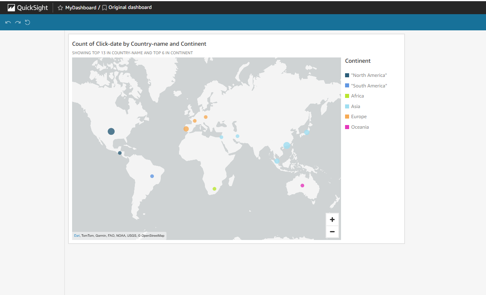

# Clickstream Business Intelligence Application

This project is an end-to-end serverless Business Intelligence (BI) application built on AWS to analyze clickstream data from user behavior on a website.

## 📊 What It Does
This application helps you:
- Collect user event data (clickstream)
- Store and transform it for analytics
- Query it with SQL (Athena)
- Visualize it with dashboards (QuickSight)

## 🧱 Architecture Overview
- **Amazon S3** – stores raw, processed, and result datasets
- **AWS Glue** – performs ETL (Extract, Transform, Load) on clickstream JSON to produce CSV analytics data
- **Amazon Athena** – runs ad hoc SQL queries on the transformed data
- **Amazon QuickSight** – provides interactive dashboards for business users
- **EC2 Instance** – simulates user events (via Python generator)
- **AWS CloudFormation** – provisions all infrastructure

## 📁 Project Structure
```
clickstream-bi-app/
├── cloudformation/
│   └── clickstream-bi-app-template.yaml      # Full AWS infrastructure setup
├── clickstream-generator/
│   ├── generator.py                          # Simulated clickstream event generator
│   ├── job.py                                # Glue ETL script
│   ├── countries_continents.csv              # Reference data for continent lookup
│   └── requirements.txt                      # Dependencies for data generator & Glue
├── screenshots/                             # Contains all result visuals
│   ├── dashboard.png                         # QuickSight dashboard
│   └── s3-results.png                        # Processed data in S3
└── README.md
```

## 🚀 How to Deploy
1. **Launch CloudFormation stack** using the template in `/cloudformation`
2. **Use EC2 or CloudShell** to run the `generator.py` script from `/clickstream-generator` by executing:
   ```bash
   python3 generator.py
   ```
3. The same directory contains:
   - `job.py` (used by AWS Glue)
   - `countries_continents.csv` (reference mapping file for translating user location IDs to actual countries and continents)
   - `requirements.txt` (lists Python packages needed: `boto3` for AWS access, `numpy` for synthetic data generation)
4. **Run the Glue job** to process and transform the data
5. **Explore the output with Athena** via SQL
6. **Visualize results with QuickSight** (map, funnel, average age, etc.)

## 🖼️ Dashboard Sample


## 🗂️ S3 Output Sample


## ✅ Features
- Event data stored in S3
- Glue ETL transforms JSON to CSV
- Athena for SQL exploration
- QuickSight for dashboarding
- Fully serverless and scalable

## 🔒 Cost-Efficient & Secure
- All services are pay-per-use
- IAM roles follow least-privilege principle
- EC2 shuts down after event generation (optional)

## 🧩 Future Improvements
- Automate Glue ETL with Step Functions
- Add lifecycle policies to S3 (e.g., Glacier for old data)
- Use real-time streaming (Kinesis + Lambda)
- Add Cognito auth for QuickSight user restriction

---

Built for demonstration and educational purposes. You can expand it into a production-grade pipeline with more event types, users, and multi-source ingestion.
