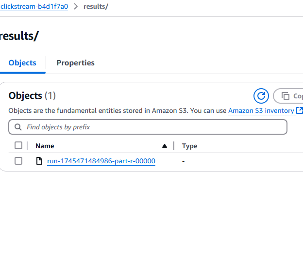

# Clickstream Business Intelligence Application

This project is more than just a bunch of AWS services stitched together. It walks you through what it means to track user behavior, process it like companies do in the real world, and make it something that analysts or managers can act on.

Here’s what we’re actually doing — and why it matters:

This project helps you understand how real companies turn user behavior into insights. We simulate activity on a website — things like clicks, views, and product interactions — and build a pipeline that ingests this data, transforms it, and makes it available for analysis and visualization.

We're doing this to demonstrate a complete business intelligence solution using AWS. Instead of managing servers or infrastructure, we use fully managed AWS services that are commonly used in the industry.

### Why each part matters:
- **Simulating the data** lets us pretend users are interacting with our website.
- **AWS Glue** processes this raw event data and cleans it for analytics.
- **Amazon Athena** allows analysts to query that data using SQL without needing a database.
- **Amazon QuickSight** gives business users a clean, visual dashboard to explore the results.

This shows how tech teams and non-technical teams can both work off the same data — but in different ways.

This project shows how to simulate and analyze user behavior using AWS. It fakes website activity, processes it with Glue, queries it with Athena, and visualizes it with QuickSight — all using fully managed AWS services. You don’t deal with servers or infrastructure manually, just focus on the data.

This project is an end-to-end serverless Business Intelligence (BI) application built on AWS to analyze clickstream data from user behavior on a website.

## 📊 What It Does
This application helps you:
- Collect user event data (clickstream)
- Store and transform it for analytics
- Query it with SQL (Athena)
- Visualize it with dashboards (QuickSight)

## 🧱 Architecture Overview
- **Amazon S3** – stores raw, processed, and result datasets
- **AWS Glue** – performs ETL (Extract, Transform, Load) on clickstream JSON to produce CSV analytics data
- **Amazon Athena** – runs ad hoc SQL queries on the transformed data
- **Amazon QuickSight** – provides interactive dashboards for business users
- **EC2 Instance** – simulates user events (via Python generator)
- **AWS CloudFormation** – provisions all infrastructure

## 📁 Project Structure
```
clickstream-bi-app/
├── cloudformation/
│   └── clickstream-bi-app-template.yaml      # Full AWS infrastructure setup
├── clickstream-generator/
│   ├── generator.py                          # Simulated clickstream event generator
│   ├── job.py                                # Glue ETL script
│   ├── countries_continents.csv              # Reference data for continent lookup
│   └── requirements.txt                      # Dependencies for data generator & Glue
├── screenshots/                             # Contains all result visuals
│   ├── dashboard.png                         # QuickSight dashboard
│   └── s3-results.png                        # Processed data in S3
└── README.md
```

## 🔧 Step-by-Step Process

1. **Provision infrastructure using CloudFormation**
   - This sets up everything for you: S3 bucket, EC2 instance, IAM roles, Glue job, parameter store, etc. No need to click through the AWS console manually.

2. **Generate clickstream data (user activity)**
   - Log into EC2 or open AWS CloudShell.
   - Run the Python script `generator.py` to simulate fake user events like clicks, views, cart activity.
   - These events are stored in S3 under the `raw/` prefix.

3. **Run AWS Glue job (data transformation)**
   - This script (`job.py`) will clean the data, convert timestamps, match location IDs to country/continent using the `countries_continents.csv`, and write the results to S3 in the `results/` folder.
   - It also moves processed raw files into a `processed/` folder.

4. **Query transformed data with Athena**
   - Use SQL queries to explore click behavior: most active regions, popular actions, user age breakdowns, etc.

5. **Create a business-friendly dashboard using QuickSight**
   - Build visuals like geographic maps, funnel charts, and average user age — so non-technical people can explore and understand what’s happening.

This pipeline shows how both engineers and business users can benefit from a shared source of clean, well-structured data.

## 🚀 How to Deploy
1. **Launch CloudFormation stack** using the template in `/cloudformation`
2. **Use EC2 or CloudShell** to run the `generator.py` script from `/clickstream-generator` by executing:
   ```bash
   python3 generator.py
   ```
3. The same directory contains:
   - `job.py` (used by AWS Glue)
   - `countries_continents.csv` (reference mapping file for translating user location IDs to actual countries and continents)
   - `requirements.txt` (lists Python packages needed: `boto3` for AWS access, `numpy` for synthetic data generation)
4. **Run the Glue job** to process and transform the data
5. **Explore the output with Athena** via SQL
6. **Visualize results with QuickSight** (map, funnel, average age, etc.)

## 🖼️ Dashboard Sample


## 🗂️ S3 Output Sample


## ✅ Features
- Event data stored in S3
- Glue ETL transforms JSON to CSV
- Athena for SQL exploration
- QuickSight for dashboarding
- Fully serverless and scalable

## 🔒 Cost-Efficient & Secure
- All services are pay-per-use
- IAM roles follow least-privilege principle
- EC2 shuts down after event generation (optional)

## 🧩 Future Improvements
- Automate Glue ETL with Step Functions
- Add lifecycle policies to S3 (e.g., Glacier for old data)
- Use real-time streaming (Kinesis + Lambda)
- Add Cognito auth for QuickSight user restriction

---

Built for demonstration and educational purposes. You can expand it into a production-grade pipeline with more event types, users, and multi-source ingestion.
